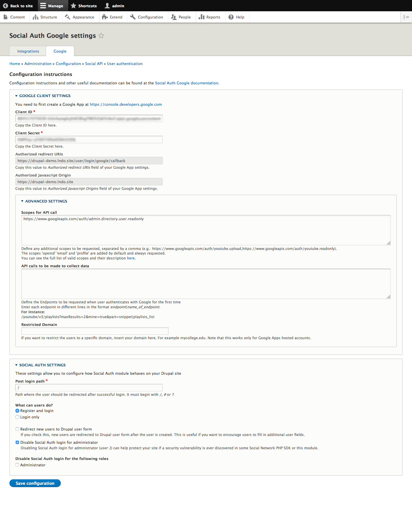

# Google SSO Insign

This module is used to allow any google member of Insign to connect to a Drupal site.  
Based on "[GSuite User Custom Fields](https://support.google.com/a/answer/6208725?hl=en)"
this module will try to sync roles to the newly created user and at each user login.

This module is based on the [Social Auth Google](https://www.drupal.org/project/social_auth_google)
project.  
It has been developed with the help of this example module : 
https://github.com/drupalsocialinitiative/social_api_examples

## Installation

This module require the following modules : `social_api`, `social_auth` and `social_auth_google` :
```
composer require "drupal/social_auth_google:^2.0"
```

Then enable this module : 
```
drush en google_sso_insign
```

Then go to `/admin/config/social-api/social-auth/google` in order to configure google OAuth settings.

Add this scope `https://www.googleapis.com/auth/admin.directory.user.readonly` in the field "Scopes for API call" (under Advanced settings).

Here is an example of the configuration :   


For more information : https://www.drupal.org/docs/8/modules/social-api/social-api-2x/social-auth-2x/social-auth-google-2x-installation

### Registration approval

This module depend on this configuration `/admin/config/people/accounts` :  
`Registration and cancellation > Who can register accounts > Visitors, but administrator approval required`.  

